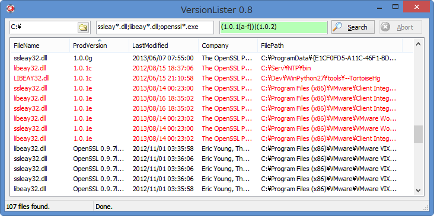

VersionLister
=============
A small tool to list up dll/exe with product version info.

* Created to search openssl's [heartbleed bug](http://heartbleed.com/) affected dlls.
* You can search dll/exe files & highlight when version matches regexp pattern.
* Default pattern is set for hertbleed bug affected dlls. 
 - Just click "search" & heartbleed bug affected version's dll is highlighted in red.

[project home](https://github.com/benok/version-lister/)

## Build

* This software is built with Delphi XE3.
* JCL & JVCL is required.

## Copyright and License

Copyright 2014 benok All rights reserved.
Licensed under the MPL 1.1 License. Copy is included in file LICENSE.txt.

The Jedi Code Library(JCL) is used in this software. 
JCL source code is available under the MPL license. The JCL can be obtained at
https://github.com/project-jedi/jcl

The Jedi Visual Component Library(JVCL) is this software.
The JVCL source code is available under the MPL license. The JVCL can be obtained at
https://github.com/project-jedi/jvcl
